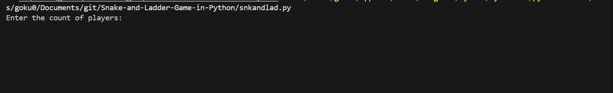
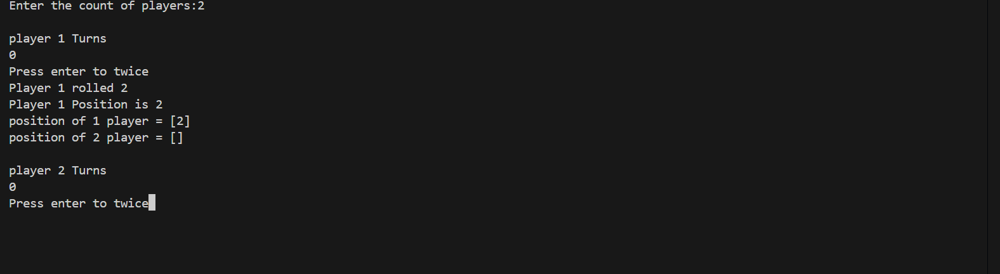
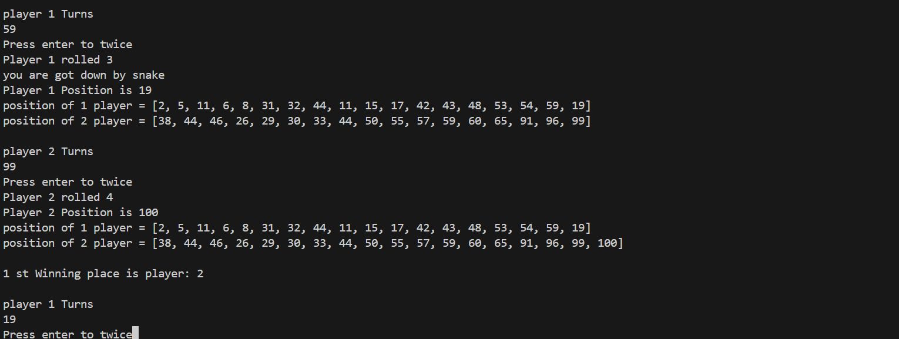
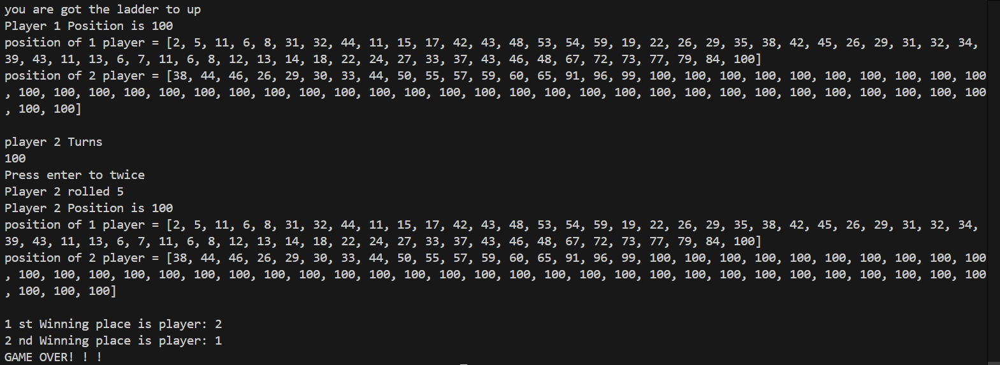

# Snake🐍 and Ladder🪜 Game in Python 
- In this file had source code to snake and ladder game 
- This game follows classic rules where players roll dice, climb ladders, and avoid snakes to reach the finish line

## Features 
- 🎲 Supports No of players
- 🐍 Randomized snake and ladder positions

## Languages 
- python 

## download 
1. clone the repository 
```bash 
    git clone https://github.com/GOKUL988/Snake-and-Ladder-Game-in-Python.git 
```
2. Navigate to the project folder 
```bash
    cd Snake-and-Ladder-Game-in-Python 
```

## Sample Images 📷 
 
## 
 
## 
 
## 
     